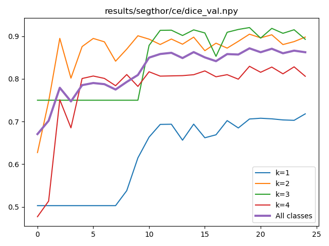

# AI for medical imaging: individual assignment 3

## Running the baseline, stitching slices to 3D volume and computing metrics

### Overview

Now that the data has been sliced, visualized, and corrected (class: heart),
the data can be used to train the first baseline model.
As the network is in 2D and works with 2D slices,
the 3D segmentation mask has to be reconstructed (i.e., stitched).
After that, the performance metrics have to be calculated with the distorch framework.

**Note: Pay close attention to the described submission format! The structure and file names are important!**

### Given resources

- codebase with slicing script (assignment 01) and assignment 02
- link to distorch framework (github): [distorch](https://github.com/jeromerony/distorch)

### Todo

1. **Run baseline model and create plot.pdf**

Running a training with [`main.py`](../main.py) for the data SEGTHOR_CLEAN:

```
$ usage: main.py [-h] [--epochs EPOCHS] [--dataset {TOY2,SEGTHOR,SEGTHOR_CLEAN}] [--mode {partial,full}] --dest DEST [--gpu] [--debug]

options:
  -h, --help            show this help message and exit
  --epochs EPOCHS
  --dataset {TOY2,SEGTHOR,SEGTHOR_CLEAN}
  --mode {partial,full}
  --dest DEST           Destination directory to save the results (predictions and weights).
  --gpu
  --debug               Keep only a fraction (10 samples) of the datasets, to test the logics around epochs and logging easily.
$ python main.py --dataset TOY2 --mode full --epoch 25 --dest results/toy2/ce --gpu
```

The codebase uses a lot of assertions for control and self-documentation,
they can easily be disabled with the `-O` option (for faster training) once everything is known to be correct
(for instance run the previous command for 1 or 2 epochs, check if everything works, and then relaunch it with `-O`):

```
$ python -O main.py --dataset SEGTHOR_CLEAN --mode full --epoch 25 --dest YOUR_RESULT_FOLDER --gpu
```

<br><br>
Plot the dice score and loss values for the training and validation set and combine all four plots into 1 A4 pdf
file. <Br>
There are some facilities to plot the metrics saved by [`main.py`](../main.py):

```
$ python plot.py --help
usage: plot.py [-h] --metric_file METRIC_MODE.npy [--dest METRIC_MODE.png] [--headless]

Plot data over time

options:
  -h, --help            show this help message and exit
  --metric_file METRIC_MODE.npy
                        The metric file to plot.
  --dest METRIC_MODE.png
                        Optional: save the plot to a .png file
  --headless            Does not display the plot and save it directly (implies --dest to be provided.
$ python plot.py --metric_file YOUR_RESULT_FOLDER/dice_val.npy --dest YOUR_RESULT_FOLDER/dice_val.png
```


**Note**: It should be visible that all four classes should be trained!

2. **Create stitchting script called stitch.py**

The input to the script (with args - see previous scripts how to do that):

- data_folder - name of the data folder with sliced data, eg data/prediction/best_epoch/val
- dest_folder - name of the destination folder with stitched data, eg val/pred
- num_classes - number of classes, eg 5
- grp_regex - pattern for the filename, eg "(Patient_\d\d)_\d\d\d\d"
- source_scan_pattern - pattern to the original scans to get original meta-data, such as size, eg "data/segthor_train/train/{id_}/GT.nii.gz" (with
  {id_} to be replaced in [stitch.py](http://stitch.py) by the PatientID)

The script should be callable by:

```
python stitch.py --data_folder FOLDER_SLICED_DATA --dest_folder FOLDER_STITCHED_DATA --num_classes 5 --grp_regex "(Patient_\d\d)_\d\d\d\d" --source_scan_pattern "data/segthor_train/train/{id_}/GT.nii.gz"
```

The output:
One 3D segmentation mask for each patient stored as nifti file (”.nii.gz”).
The shape should match the original scan shape, the values of the segmentation are np.uint8 ranging 0-255 (for segthor
data, it should have 0-4).

**Hint**: You can test your script on the GT segmentation masks of the training and/or validation set. There you have
both, sliced and original, data available.

3. **Calculate metrics with distorch**

Install [distorch](https://github.com/jeromerony/distorch) according to the instructions in the repo description.

You should use the script compute_metrics.py for the calculation of Dice and HD95.
Check the options and set the correct values for metrics, ref_folder, pred_folder, ref_extension, pred_extension,
num_classes, save_folder, see the help for explanation:

```
python compute_metrics.py --help
usage: compute_metrics.py [-h] --ref_folder REF_FOLDER --pred_folder PRED_FOLDER --ref_extension {.nii.gz,.png,.npy,.nii} [--pred_extension {.nii.gz,.png,.npy,.nii}]
                          --num_classes NUM_CLASSES [--ignored_classes [IGNORED_CLASSES ...]]
                          [--metrics {3d_hd,3d_hd95,3d_assd,3d_dice,3d_jaccard,pixel_accuracy,confusion_matrix} [{3d_hd,3d_hd95,3d_assd,3d_dice,3d_jaccard,pixel_accuracy,confusion_matrix} ...]]
                          [--cpu] [--num_workers NUM_WORKERS] [--overwrite] [--crop] [--background_class BACKGROUND_CLASS] [--chill] [--save_folder SAVE_FOLDER]

Compute metrics for a list of images

options:
  -h, --help            show this help message and exit
  --ref_folder REF_FOLDER
  --pred_folder PRED_FOLDER
  --ref_extension {.nii.gz,.png,.npy,.nii}
  --pred_extension {.nii.gz,.png,.npy,.nii}
  --num_classes NUM_CLASSES, -K NUM_CLASSES, -C NUM_CLASSES
  --ignored_classes [IGNORED_CLASSES ...]
                        Classes to skip (for instance background, or any other non-predicted class).
  --metrics {3d_hd,3d_hd95,3d_assd,3d_dice,3d_jaccard,pixel_accuracy,confusion_matrix} [{3d_hd,3d_hd95,3d_assd,3d_dice,3d_jaccard,pixel_accuracy,confusion_matrix} ...]
                        The metrics to compute.
  --cpu
  --num_workers NUM_WORKERS
                        Number of workers for the dataloader. Higher is not always better, depending on hardware (CPU notably).
  --overwrite           Overwrite existing metrics output, without prompt.
  --crop                Crop the scans around the objects, discarding parts that contain only the background class.
  --background_class BACKGROUND_CLASS
  --chill               Does not enforce that both folders have exactly the same scans inside, keep the intersection of the two.
  --save_folder SAVE_FOLDER
                        The folder where to save the metrics
```

### To submit

A **zip folder called student-nnn.zip** (nnn being your number) with the following content:

- stitching script (stitch.py);
- stitched prediction segmentation masks of the validation scans (in folder val/pred - this should be the same files taht you use for the metrics calcucation, i.e., 3D files);
- GT segmentation masks of the validation scans (in folder val/gt - this should be the same files that you used for the metrics calculation, i.e., 3D files);
- plots of training and validation dice and loss in 1 A4 page (plot.png or plot.pdf);
- bestweights.pt and best_epoch.txt file;
- computed metrics as .npz following the described format.

and the following structure:

```
student-nnn.zip
    val/
        pred/
            Patient_XY.nii.gz
            Patient_ZZ.nii.gz
            ...
        gt/
            Patient_XY.nii.gz
            Patient_ZZ.nii.gz
            ...
        3d_hd95.npz
        3d_dice.npz
    stitch.py
    plot.pdf or plot.png
    bestweights.pt
    best_epoch.txt
```

**Note**: The structure and file names are important! As part of the evaluation is automatic, you risk getting 0 points
if you do not follow the described format and naming convention!

### Grading

1. training baseline and plot (2 points)
2. stitch.py script (6 points)
3. calculate metrics (2 points)
